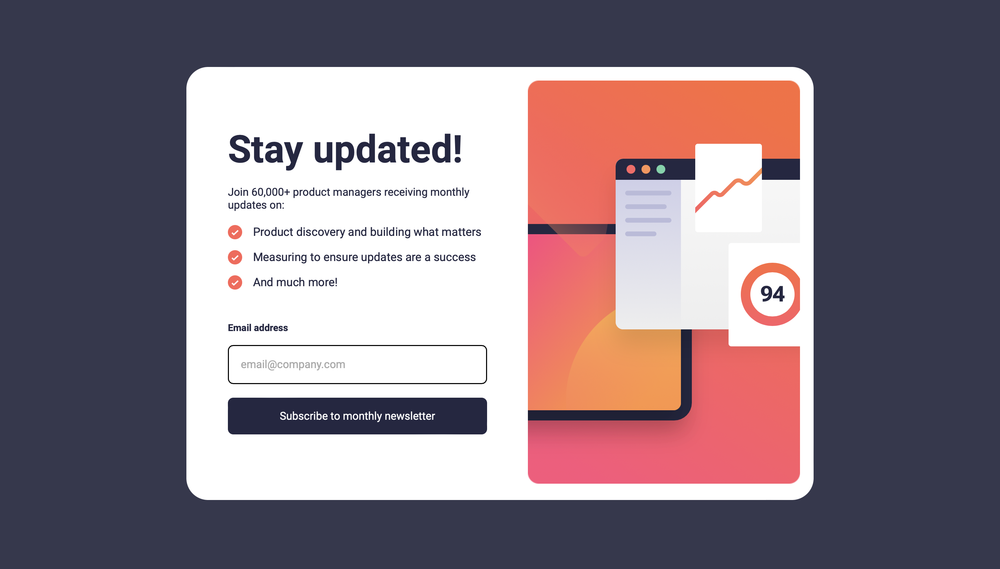

# Frontend Mentor - Newsletter sign-up form with success message solution

This is a solution to the [Newsletter sign-up form with success message challenge on Frontend Mentor](https://www.frontendmentor.io/challenges/newsletter-signup-form-with-success-message-3FC1AZbNrv). Frontend Mentor challenges help you improve your coding skills by building realistic projects. 

## Table of contents

- [Overview](#overview)
  - [The challenge](#the-challenge)
  - [Screenshot](#screenshot)
  - [Links](#links)
- [My process](#my-process)
  - [Built with](#built-with)
  - [What I learned](#what-i-learned)
  - [Continued development](#continued-development)
  - [Useful resources](#useful-resources)
- [Author](#author)

## Overview

### The challenge

Users should be able to:

- Add their email and submit the form
- See a success message with their email after successfully submitting the form
- See form validation messages if:
  - The field is left empty
  - The email address is not formatted correctly
- View the optimal layout for the interface depending on their device's screen size
- See hover and focus states for all interactive elements on the page

### Screenshot

### Links

- Solution URL: [GitHub](https://github.com/AltaOfficial/frontendmentor3)
- Live Site URL: [Netlify](https://heroic-melba-920000.netlify.app)

## My process

- Adding needed colors/fonts to stylesheet and other common practices
- Stuctured HTML pages
- Stuctured CSS for mobile first
- Stuctured CSS for desktop
- Added interactive animations
- Programmed javascript to handle email validation
- Edited README

### Built with

- Semantic HTML5 markup
- Flexbox
- CSS Grid
- Javascript

### What I learned

I learned doing this project that transitions don't work with gradients in CSS, there are most likely workarounds but I'm sad it's not built in 😕, I also learned that using textContent over innerText or inner HTML can prevent XSS attacks and that the attribute bracket in CSS applies for more than just selecting elements by type.

### Continued development

I really like the result of this project but when it came to aligning and position the elements it took longer than id like it to, so in the future id like to work on more projects that challenge me in that way.

### Useful resources

- [Resource 1](https://www.w3schools.com/css/css_grid_item.asp) - This helped me figure out how to move the image container to the other side in desktop mode.
- [Resource 2](https://www.geeksforgeeks.org/how-to-position-a-div-at-the-bottom-of-its-container-using-css) - Helped me figure out how to position the dismiss button at the bottom.
- [Resource 3](https://www.w3schools.com/css/css_align.asp) - Needed help centering the dismiss button on the success page.

## Author

- Frontend Mentor - [@altaofficial](https://www.frontendmentor.io/profile/altaofffical)
- GitHub - [@altaofficial](https://www.github.com/altaofficial)
